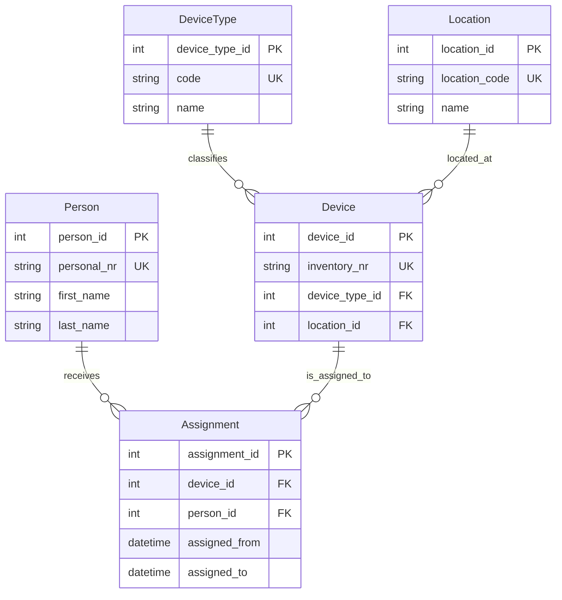

# Inventar – ER-Modell (Mermaid)

## ER-Diagramm

## Regeln

**R1 – Eindeutigkeit (UK)**
- `Device.inventory_no` (**= inventory_nr im ERD**) ist eindeutig.
- `Person.personnel_no` (**= personal_nr im ERD**) ist eindeutig.
- `DeviceType.code` ist eindeutig.
- `Location.code` ist eindeutig.

**R2 – max. 1 Zuweisung je Device**
- zu jedem Zeitpunkt darf ein Device höchstens eine aktive Zuweisung haben 

**R3 – assigned_to darf leer sein**
- `Assignment.assigned_to` darf leer sein (aktiver Zustand)
